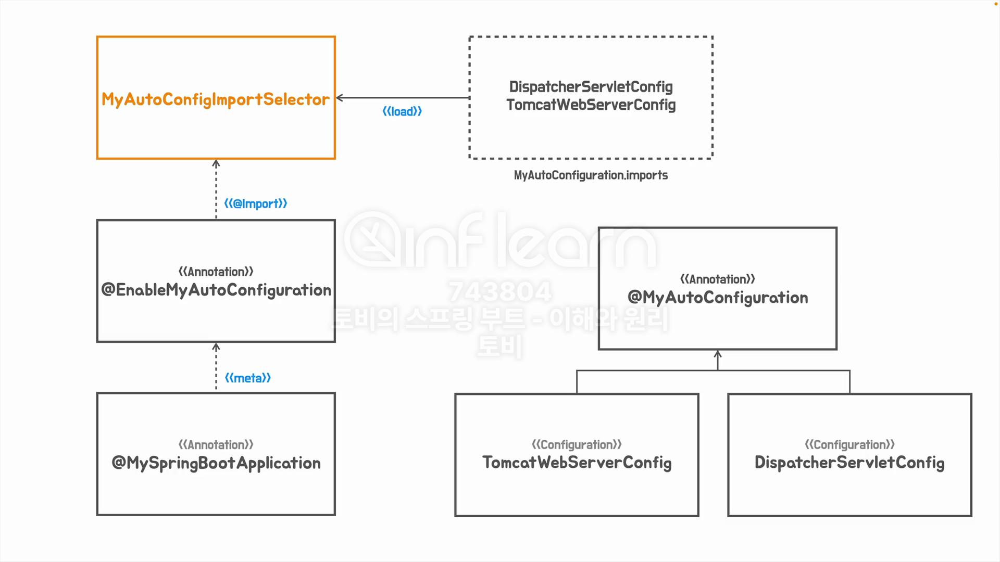

# Toby-s-Spring-Spring-Boot
토비의 스프링 / 스프링부트 

### 애플리케이션 빈 vs 컨테이너 인프라스트럭쳐 빈
#### 애플리케이션 빈
- 개발자가 어떤 빈을 사용하겠다 라고 명시적으로 구성 정보를 제공
  - 애플리케이션 로직 빈(사용자 구성 정보) -> ComponentScan 활용
  - ex) Controller
  - 애플리케이션 인프라스트럭쳐 빈(자동 구성 정보) -> AutoConfiguration 활용
  - ex) DataSource, JdbcTransactionManager
  - ex) TomcatServletWebServerFactory, DispatcherServlet

#### 컨테이너 인프라스트럭쳐 빈
- 스프링 컨테이너 자신이거나, 스프링이 확장하면서 추가해온 것들
- ApplicationContext/BeanFactory, Environment, 빈후처리기, DefaultAdvisorAutoProxyCreator

#### ApplicationContextAware
- ApplicationContextAware를 구현하면 이 인터페이스에 있는 setter를 사용해서
컨테이너가 빈을 초기화 하면서 빈 오브젝트를 주입

#### ImportSelector
- 동적으로 Configuration을 Import 가능하게 해준다.
- 동적의 예시는 yml 이나 DB에서 값을 읽어와서 로딩이 가능.

- 동적으로 구성 정보를 사용할 클래스 파일을 외부에서 읽어오는 전체적인 그림

#### Configuration과 proxyBeanMethods
